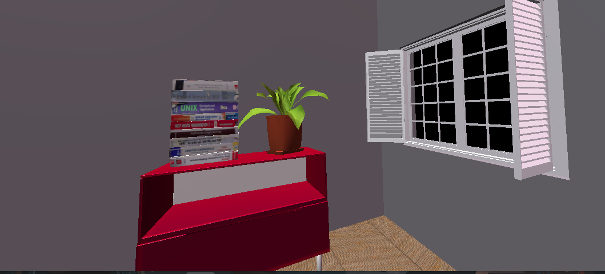
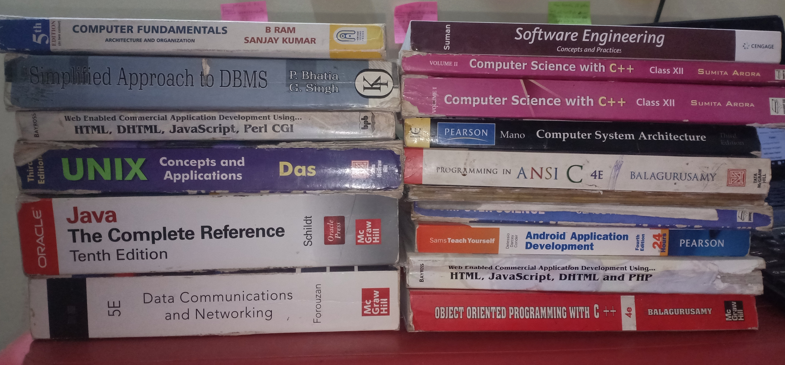

    

As far as Facebook with META and other top companies such as google,microsoft etc with VR AR technologies,gradually stepping into 3D world. It seems obvious that in future 3D will be dominant technology so i built the website which deals with most controvesial hypothesis <b><i>THE SIMULATION THEORY</i></b>.

Utilized <code>three.js ammo.js tween.js</code> to build with <a href="https://www.vectary.com/"><ins>vectary</ins></a> which is Blender equivalent in lighter way.

<h4><b>Use-</b></h4>
keyboard's UP,LEFT,RIGHT do rotation forward, left, right respectively. Taking steps towards mirror will eventually gets out of simulation and shows list of projects i have done for fun till now.

Notice Books.
  
  
<a href="https://dudisimulationapp.netlify.app/"><b>Application Link</b></a> <a href="https://drive.google.com/file/d/15pl547moiAd13vn7FIVso5-eZnP5TJNl/view?usp=sharing"><b>Application video</b></a><h6><em> OPEN ONLY ON LAPTOP OR DESKTOP! NOT COMPETIBLE WITH PHONES</em></h6>

<h3>Mirror and Books textures</h3>
<pre> 
</pre>
</pre>
